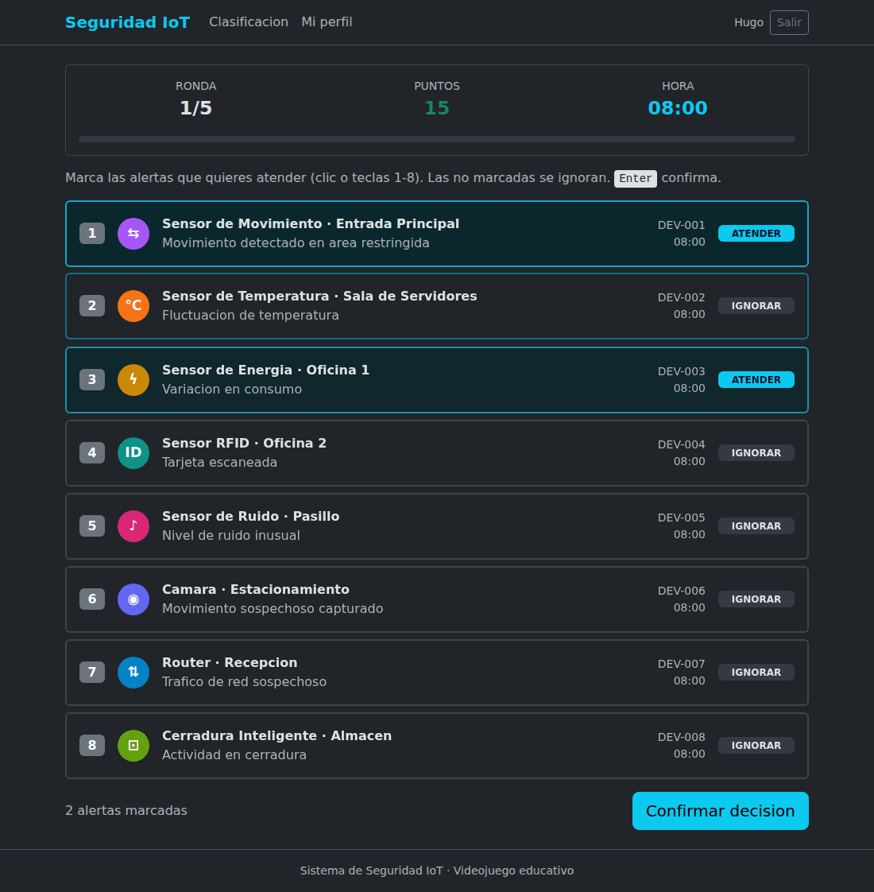
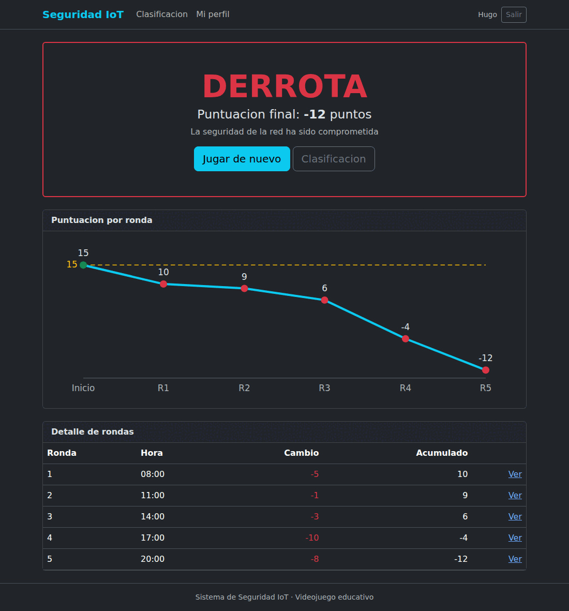
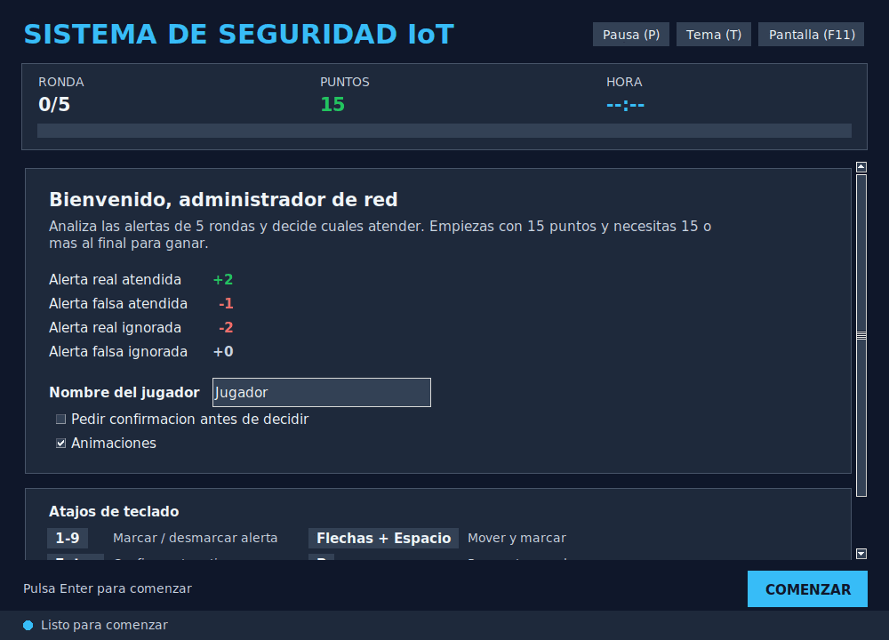
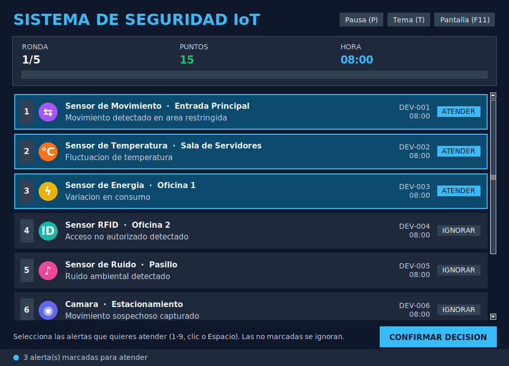
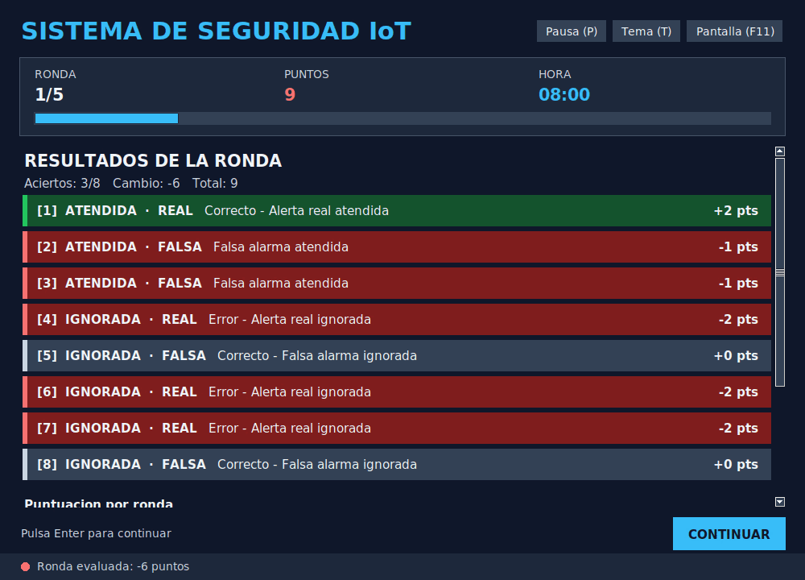
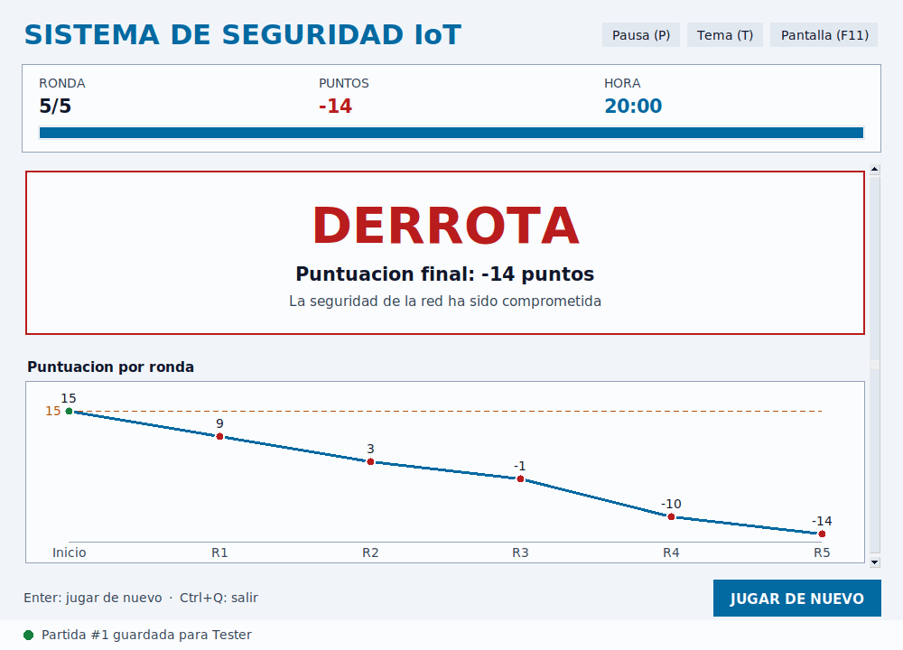

# Sistema de Seguridad IoT

[](https://github.com/rafj26/JuegoIoT/actions/workflows/ci.yml)

Videojuego educativo desarrollado en Python que simula la gestión de alertas en una red de dispositivos IoT. El jugador asume el rol de administrador de sistemas y debe analizar alertas para determinar cuáles son reales y cuáles falsas, manteniendo la seguridad de la red.

## Descripcion General

Este proyecto es una implementación de un videojuego de seguridad IoT que demuestra conceptos avanzados de programación en Python, incluyendo Programación Orientada a Objetos, herencia, patrones de diseño y arquitectura de software.

El juego presenta una red de 8 dispositivos IoT diferentes (sensores de movimiento, temperatura, energia, RFID, ruido, camaras, routers y cerraduras inteligentes) que generan alertas durante 5 rondas. El jugador debe decidir qué alertas atender basándose en el analisis de la informacion disponible.

## Caracteristicas Principales

Programacion Orientada a Objetos - Implementacion completa con clases, herencia y polimorfismo

Herencia y Clases Abstractas - Clase base DispositivoBase que define la interfaz comun para todos los dispositivos

Patron MVC - Separacion clara entre Modelo (logica), Vista (presentacion) y Controlador (coordinacion)

Dos Interfaces de Usuario - Version terminal simple y version grafica con Tkinter

Dispositivos IoT Variados - 8 tipos de dispositivos con comportamiento especializado

Sistema de Puntuacion Dinamico - Reglas de juego bien definidas con bonificaciones y penalizaciones

Simulacion Contextual - Alertas generadas segun factores como hora del dia, dia de la semana

## Requisitos del Sistema

Python 3.9 o superior

Tkinter (incluido en la instalacion estandar de Python)

Sistema operativo: Windows, macOS o Linux (probado en Fedora)

## Instalacion

Clonar el repositorio:

```bash
git clone https://github.com/tunombre/Sistema-Seguridad-IoT.git
cd Sistema-Seguridad-IoT
```

Verificar que Python este instalado:

```bash
python3 --version
```

No es necesario instalar dependencias adicionales, todas las librerias utilizadas vienen incluidas en Python.

## Como Ejecutar

Version Terminal:

```bash
python3 main.py
```

Version con Interfaz Grafica (Tkinter):

```bash
python3 main_gui.py
```

## Version Web (Django)

La carpeta `iot_web/` contiene una version web con registro de usuarios,
partidas guardadas en base de datos, tabla de clasificacion y perfil con
estadisticas. Reutiliza la logica de `modelos/` mediante un adaptador
(`juego_app/adaptador.py`), asi que las reglas son las mismas que en la
version de escritorio.

```bash
pip install -r requirements.txt
cd iot_web
python manage.py migrate
python manage.py createsuperuser   # Acceso a /admin/
python manage.py runserver         # http://127.0.0.1:8000/
python manage.py test              # Tests de la version web
```

| Ronda | Resultado final |
|---|---|
|  |  |

Paginas: inicio, registro, login, partida (ronda y resultado de cada ronda),
resultado final con grafica, clasificacion y perfil. Las alertas se generan
en el servidor y nunca se envia al navegador si son reales hasta que el
jugador decide.

Variables de entorno para produccion: `DJANGO_SECRET_KEY`,
`DJANGO_DEBUG=0`, `DJANGO_ALLOWED_HOSTS`, `DJANGO_CSRF_TRUSTED_ORIGINS`,
`DJANGO_DB_PATH` y `DJANGO_TIME_ZONE`.

### API REST

La API (Django REST Framework) permite jugar desde apps moviles. La
documentacion interactiva esta en `/api/docs/` (Swagger) y `/api/redoc/`;
el esquema OpenAPI en `/api/schema/`.

| Metodo | Ruta | Descripcion |
|---|---|---|
| POST | `/api/token/` | Obtener token (`username`, `password`) |
| GET, POST | `/api/partidas/` | Listar mis partidas / crear una nueva |
| GET, DELETE | `/api/partidas/{id}/` | Ver partida con rondas / eliminar si esta en curso |
| GET | `/api/partidas/{id}/ronda/` | Alertas de la ronda en curso |
| POST | `/api/partidas/{id}/decidir/` | Decidir: `{"alertas": [1, 3]}` |
| GET | `/api/rondas/?partida={id}` | Rondas jugadas |
| GET | `/api/leaderboard/` | Clasificacion (publica) |
| GET | `/api/estadisticas/` | Mis estadisticas |

```bash
TOKEN=$(curl -s -X POST localhost:8000/api/token/ -d username=ana -d password=... | jq -r .token)
curl -H "Authorization: Token $TOKEN" -X POST localhost:8000/api/partidas/
curl -H "Authorization: Token $TOKEN" localhost:8000/api/partidas/1/ronda/
curl -H "Authorization: Token $TOKEN" -H "Content-Type: application/json" \
     -d '{"alertas": [1, 3]}' localhost:8000/api/partidas/1/decidir/
```

## Historial de Partidas (SQLite)

Cada partida terminada se guarda en `datos/partidas.db` (tablas `partidas`,
`rondas` y `estadisticas`). La logica esta en `modelos/persistencia.py`.

```bash
python3 main.py --jugador Ana           # Jugar y guardar como "Ana"
python3 main.py --sin-guardar           # Jugar sin guardar
python3 main.py --historial             # Ver historial
python3 main.py --estadisticas          # Ver estadisticas por jugador
python3 main.py --exportar historial.csv
```

## Logs

Ambas versiones registran la partida en `logs/juego.log` (inicio de ronda,
decisiones del jugador, calculo de puntos y errores). La carpeta se crea sola
y esta excluida de git. La configuracion esta en `utilidades/registro.py`.

## Interfaz Grafica

| Bienvenida | Alertas |
|---|---|
|  |  |
| **Resultados** | **Final (tema claro)** |
|  |  |

- Tarjetas de alerta con icono por tipo de dispositivo; clic para marcar.
- Barra de progreso de rondas y grafica de puntuacion por ronda.
- Indicador de estado (informacion, cargando, exito, error) en la parte inferior.
- Confirmacion opcional antes de decidir, pausa/reanudar y animaciones
  (se pueden desactivar).
- Tema oscuro y claro con contraste alto, ventana redimensionable, scroll con
  rueda del raton y pantalla completa.
- Las preferencias (tema, pantalla completa, confirmacion, animaciones,
  nombre del jugador y tamano de ventana) se guardan en
  `datos/preferencias_gui.json`.
- Las partidas de la GUI tambien se guardan en el historial SQLite.

Atajos de teclado:

| Tecla | Accion |
|---|---|
| `1`-`9` | Marcar / desmarcar alerta |
| Flechas + `Espacio` | Mover el cursor y marcar |
| `Enter` | Comenzar / confirmar / continuar |
| `P` | Pausar / reanudar |
| `T` | Cambiar tema |
| `F11` / `Esc` | Activar / salir de pantalla completa |
| `Ctrl+Q` | Salir |

## Tests

```bash
pip install -r requirements-dev.txt
pytest                        # Ejecutar todos los tests
pytest --cov=modelos tests/   # Con reporte de cobertura
xvfb-run -a pytest tests/test_gui.py   # Tests de la GUI en Linux sin pantalla
```

Los tests estan en `tests/`: `test_juego.py`, `test_red_iot.py`,
`test_dispositivos.py`, `test_integracion.py`, `test_persistencia.py`,
`test_utilidades.py` y `test_gui.py` (se omite si no hay Tkinter o pantalla).

## Integracion Continua

`.github/workflows/ci.yml` se ejecuta en cada push a `main`/`develop` y en
cada Pull Request:

- Verificacion de sintaxis (`compileall`) y lint con flake8 (configurado en `.flake8`).
- Tests con pytest en Python 3.10, 3.11 y 3.12 (la GUI se prueba con Xvfb),
  con reporte de cobertura en el resumen del job y como artefacto.
- Tests de la version web, migraciones pendientes y validacion del esquema OpenAPI.
- Generacion de la documentacion con Sphinx (falla ante cualquier warning).

## Documentacion

La documentacion de la API se genera con Sphinx (tema Read the Docs) a partir
de los docstrings (formato Google) de todas las clases y metodos.

```bash
pip install -r requirements-docs.txt
cd docs
make html          # Abrir docs/_build/html/index.html
```

Al hacer push a `main`, el workflow `.github/workflows/docs.yml` la publica en
GitHub Pages (requiere activar en *Settings > Pages* la fuente
"GitHub Actions").

## Como Jugar

El juego presenta 5 rondas en las que se generan alertas automaticamente en la red.

En cada ronda:
1. Se mostran las alertas generadas por los dispositivos IoT
2. Cada alerta tiene informacion: hora, tipo de dispositivo, ubicacion, descripcion
3. Debes seleccionar cuales alertas atender
4. El sistema evalua tus decisiones

Sistema de Puntuacion:

Puntos iniciales: 15 puntos

Alerta real atendida correctamente: +2 puntos

Alerta falsa atendida: -1 punto

Alerta real no atendida (ignorada): -2 puntos

Alerta falsa ignorada correctamente: 0 puntos

Condiciones de Victoria/Derrota:

Victoria: Finalizar con 15 o mas puntos de seguridad

Derrota: Finalizar con menos de 15 puntos

## Estructura del Proyecto

El codigo sigue el patron MVC, con cada capa en su propio paquete:

```
JuegoIoT/
├── modelos/                    # Modelo: logica de negocio
│   ├── __init__.py
│   ├── juego.py                # Rondas, puntuacion y resultado final
│   ├── red_iot.py              # Red con los 8 dispositivos
│   ├── alerta.py               # Alerta individual
│   └── dispositivos/
│       ├── __init__.py
│       ├── dispositivo_base.py # Clase abstracta base
│       ├── sensor_movimiento.py
│       ├── sensor_temperatura.py
│       ├── sensor_energia.py
│       ├── sensor_rfid.py
│       ├── sensor_ruido.py
│       ├── camara.py
│       ├── router.py
│       └── cerradura.py
├── vistas/                     # Vista: presentacion
│   ├── __init__.py
│   ├── vista.py                # Terminal
│   └── vista_gui.py            # Tkinter
├── controladores/              # Controlador: coordinacion
│   ├── __init__.py
│   ├── controlador.py          # Terminal
│   └── controlador_gui.py      # Tkinter
├── main.py                     # Entrada version terminal
├── main_gui.py                 # Entrada version grafica
└── README.md
```

Los imports son absolutos desde la raiz del proyecto (por ejemplo
`from modelos.juego import JuegoSeguridadIoT`), por lo que los programas se
ejecutan desde la carpeta raiz.

## Flujo de Ramas

- `main`: codigo estable (produccion).
- `develop`: area de pruebas. Todo cambio se integra primero aqui.
- Ramas de trabajo (`feature/...`, `fix/...`): se crean desde `develop` y se
  fusionan de vuelta en `develop` mediante Pull Request.

Cuando `develop` esta probado, se fusiona en `main`.

```bash
git checkout develop
git pull
git checkout -b feature/mi-cambio
# ... cambios ...
git push -u origin feature/mi-cambio   # abrir PR hacia develop
```

## Conceptos Implementados

Programacion Orientada a Objetos

Uso completo de clases y objetos

Encapsulamiento con atributos privados (convencion _nombre)

Metodos de instancia, metodos estaticos

Herencia y Polimorfismo

Clase abstracta DispositivoBase que define la interfaz

Ocho clases concretas que heredan de DispositivoBase

Sobrescritura de metodos (override) con super()

Metodos abstractos que fuerzan implementacion en clases hijas

Patron de Diseno MVC

Modelo: Contiene la logica de negocio (paquete modelos/)

Vista: Responsable de presentacion (paquete vistas/)

Controlador: Coordina modelo y vista (paquete controladores/)

Beneficio: La logica del juego se reutiliza en dos interfaces diferentes

Buenas Practicas de Desarrollo

Separacion de responsabilidades

Constantes de clase para valores fijos

Metodos pequenos y especificos

Nombres descriptivos y consistentes

Comentarios en puntos complejos

Validacion de entrada del usuario

Manejo de excepciones

Reutilizacion de codigo (DRY - Don't Repeat Yourself)

## Diagrama de Flujo

```
Inicio del Juego
    |
    v
Mostrar Pantalla de Bienvenida
    |
    v
Para cada Ronda (1-5):
    |
    +-- Inicializar Ronda
    |   |
    |   v
    |   Generar Alertas en todos los Dispositivos
    |   |
    |   v
    |   Mostrar Alertas al Jugador
    |   |
    |   v
    |   Solicitar Decision (que alertas atender)
    |   |
    |   v
    |   Procesar Decisiones y Actualizar Puntos
    |   |
    |   v
    |   Mostrar Resultados de la Ronda
    |
    v
Mostrar Pantalla Final
    |
    v
Mostrar Victoria o Derrota segun Puntos
    |
    v
Fin del Juego
```

## Tecnologias Utilizadas

Lenguaje: Python 3.9+

Interfaz Grafica: Tkinter (libreria nativa de Python)

Librerias del Sistema: random, datetime, abc (Abstract Base Classes)

## Ejemplos de Uso

Ejemplo Terminal:

```
==============================================================
SISTEMA DE SEGURIDAD IoT - ADMINISTRADOR DE REDES
==============================================================
Puntos iniciales: 15
Rondas totales: 5

Objetivo: Mantener 15 o mas puntos

Reglas de puntuacion:
  Alerta real atendida: +2 puntos
  Alerta falsa atendida: -1 punto
  Alerta real NO atendida: -2 puntos
  Alerta falsa NO atendida: 0 puntos
==============================================================

============================================================== 
RONDA 1/5
Puntos actuales: 15
==============================================================

Alertas detectadas a las 08:00:
--------------------------------------------------------------
[1] 08:00 | Sensor de Movimiento
    Ubicacion: Entrada Principal
    Alerta: Movimiento detectado en area restringida
    ID: DEV-001
--------------------------------------------------------------
[2] 08:00 | Sensor de Temperatura
    Ubicacion: Sala de Servidores
    Alerta: Fluctuacion de temperatura
    ID: DEV-002
--------------------------------------------------------------

Ingrese numeros de alertas a atender (separados por comas)
O ingrese 0 para no atender ninguna:
> 1
```

## Arquitectura del Codigo

La estructura utiliza el patron MVC con separacion clara de responsabilidades:

El Modelo (juego.py) contiene la logica del juego pero NO imprime nada. Solo retorna datos estructurados en diccionarios.

La Vista (vista.py / vista_gui.py) recibe datos del modelo y los presenta. No contiene logica de negocio.

El Controlador (controlador.py / controlador_gui.py) coordina las llamadas entre modelo y vista, manejando el flujo de ejecucion.

Esta arquitectura permite tener dos interfaces completamente diferentes sin duplicar la logica del juego.

## Preguntas Frecuentes

¿Puedo ejecutar esto en Windows?

Si, Python y Tkinter funcionan perfectamente en Windows. Solo necesitas tener Python instalado.

¿Cual es la diferencia entre main.py y main_gui.py?

main.py ejecuta la version con interfaz de terminal (texto)
main_gui.py ejecuta la version con interfaz grafica (ventanas visuales)

La logica del juego es identica en ambas, solo cambia la presentacion.

¿Puedo modificar las reglas del juego?

Si, todas las constantes estan definidas en la clase JuegoSeguridadIoT:
PUNTOS_INICIALES
TOTAL_RONDAS
PUNTOS_ALERTA_REAL_ATENDIDA
etc.

Solo modificas estos valores y el juego se adapta automaticamente.

¿Como agrego un nuevo tipo de dispositivo?

1. Crea un nuevo archivo en la carpeta modelos/dispositivos/
2. Hereda de DispositivoBase
3. Implementa los metodos abstractos
4. Agregalo a la lista de dispositivos en red_iot.py

¿Necesito instalar Tkinter por separado?

No, Tkinter viene incluido en la instalacion estandar de Python. Si por alguna razon no lo tienes, instalalo con:

```bash
sudo dnf install python3-tkinter
```

## Contacto

Para preguntas o sugerencias, abre un issue en el repositorio.